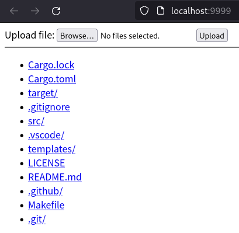

# Easy Server

`easy-server` mainly acts as a static file server.

## Screenshot



## Usage

```YAML
easy-server 
Just a easy sever.

USAGE:
    easy-server [OPTIONS]

OPTIONS:
    -a, --address <IP>       Set the listening IP address [default: 0.0.0.0]
    -d, --directory <DIR>    Set the working root directory [default: .]
    -h, --help               Print help information
    -p, --port <PORT>        Set the listening port [default: 9999]
```

## License

This project is released under the [GNU General Public License v3.0](./LICENSE).    